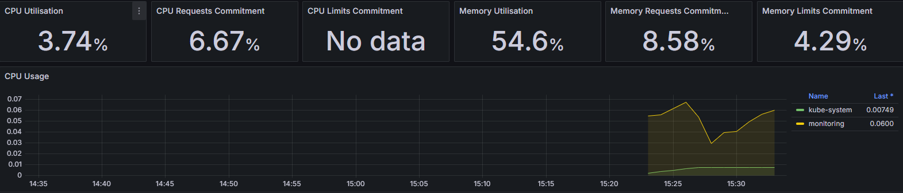
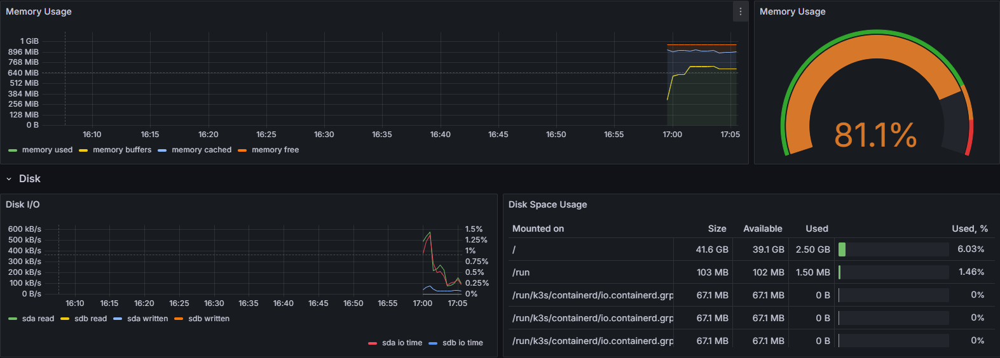

# K3s Local Cluster Deployment with VirtualBox, Vagrant, and Ansible


A k3s cluster that you can automatically launch using VirtualBox, Vagrant, and Ansible from a Windows host machine. The cluster 
has Prometheus and Grafana installed for monitoring.

Instructions on how to install Prometheus and Grafana to monitor the cluster are included.





## Table of Contents

* [Overview](#overview)
* [Requirements](#requirements)
  * [Install Chocolatey](#install-chocolatey)
  * [Install VirtualBox, Vagrant, and Git](#install-virtualbox-vagrant-and-git)
* [Setup](#setup)
* [Starting the Cluster](#starting-the-cluster)
* [Verifying the Cluster](#verifying-the-cluster)
* [Accessing the Cluster](#accessing-the-cluster)
* [Starting Prometheus and Grafana](#starting-prometheus-and-grafana)
* [Accessing Prometheus and Grafana](#accessing-prometheus-and-grafana)
* [Tearing Down the Cluster](#tearing-down-the-cluster)
* [Troubleshooting](#troubleshooting)

---

## Overview

This project provides a simple and automated way to spin up a k3s Kubernetes cluster using:

* **VirtualBox** as the VM provider
* **Vagrant** to orchestrate VMs
* **Ansible** for provisioning and k3s setup

All from a **Windows host machine** using **PowerShell**.

---

## Requirements

To run this project there are a few dependencies you must install first.

* **Chocolatey** - package manager
* **Vagrant** - Infrastructure as Code tool to spin up the machines needed for the cluster
* **VirtualBox** - Virtualization software needed to host the linux VMs
* **Git** - To download this repository
* **kubectl** - The CLI for interacting with the cluster
* **helm** - interacting with the cluster

### Install Chocolatey

Chocolatey is used to simplify installation of required packages. Run PowerShell as **Administrator** and execute:

```Powershell
Set-ExecutionPolicy Bypass -Scope Process -Force; [System.Net.ServicePointManager]::SecurityProtocol = [System.Net.ServicePointManager]::SecurityProtocol -bor 3072; iex ((New-Object System.Net.WebClient).DownloadString('https://community.chocolatey.org/install.ps1'))
```

After installation, restart your terminal or run `refreshenv`.

### Install VirtualBox, Vagrant, and Git

Once Chocolatey is installed, run the following in PowerShell (admin):

```Powershell
choco install virtualbox vagrant git kubernetes-cli kubernetes helm -y
```

> You may also want to install an editor like VS Code or vim:
>
> ```Powershell
> choco install vscode -y
> # Or for vim 
> choco install vim -y
> ```

---

## Setup

1. **Clone this repository**:

   ```Powershell
   git clone https://github.com/EthanGilles/Local-Windows-K3S-Cluster.git
   cd Local-Windows-K3S-Cluster
   ```

2. **(Optional) Customize Configuration**
   Modify the `Vagrantfile` to adjust VM specs or node count. You may also edit `inventory.ini` for Ansible host definitions.

---

## Starting the Cluster

1. **Launch the Vagrant-managed VMs** (run from your project directory in PowerShell):

   ```powershell
   vagrant up
   ```

And thats it! Feel free to go grab a cup of coffee, this command might take a minute. Your whole k3s cluster will launch and automatically start up 
because of the ansible playbook.

---

## Verifying the Cluster

1. **SSH into the control node**:

   ```powershell
   vagrant ssh control 
   ```

2. **Use kubectl to verify the nodes are ready**:

   ```bash
   kubectl get nodes
   ```

   You should see output showing your master and worker nodes in the `Ready` state similar to this:

   ```console
    NAME      STATUS   ROLES                  AGE   VERSION
    master    Ready    control-plane,master   17m   v1.32.4+k3s1
    worker1   Ready    <none>                 17m   v1.32.4+k3s1
    worker2   Ready    <none>                 17m   v1.32.4+k3s1
   ```

---

## Accessing the Cluster

To interact with the k3s cluster from your host environment:

1. **Copy the kubeconfig file from the master node (only if you have the vargrant-scp plugin)**:

   ```Powershell
    vagrant scp control:~/.kube/config ./config
   ```

2. **Move the file into ~/.kube/config** and delete any other config file you may have there:

    ```Powershell
    Move-Item -Path .\config -Destination "$env:USERPROFILE\.kube\config" -Force
    ```

3. **Test the connection**:

   ```Powershell
   kubectl get nodes
   ```
   You should see output similar to the example shown above.


---

## Starting Prometheus and Grafana

1. Download the Helm chart for Prometheus and Grafana and make sure its updated:
    ```Powershell
    helm repo add prometheus-community https://prometheus-community.github.io/helm-charts
    helm repo update
    ```

2. Create a new namespace for the monitoring pods:
    ```Powershell
    kubectl create namespace monitoring
    ```

3. Create a secret for the Grafana Web UI login. (Change this if you want to use your own credentials):
    ```Powershell
    kubectl create secret generic grafana-admin-credentials --from-literal=admin-user=<YOUR-USER> --from-literal=admin-password=<YOUR-PASSWORD> -n monitoring
    ```

4. Install and start Grafana and Prometheus using helm:
    ```Powershell
    helm install prometheus prometheus-community/kube-prometheus-stack --namespace monitoring  --values .\values.yaml
    ```

---

## Accessing Prometheus and Grafana

After installing Prometheus and Grafana to your K3S cluster, they are being 
exposed via NodePort services. 

To access the Grafana UI, use a web browser to navigate to `http://172.42.42.100:30000` and login with the credentials you set in the previous step.

To access the Prometheus UI, use a web browser to navigate to `http://172.42.42.100:30001`. There will be no login required.

---

## Tearing Down the Cluster

To destroy all VMs created by Vagrant:

```powershell
vagrant destroy -f
```

This will remove the virtual machines and free up system resources.

---

## Troubleshooting

* **Vagrant SSH issues**: Try `vagrant reload` or `vagrant provision`.
* **VirtualBox VM boot errors**: Verify virtualization is enabled in your BIOS (VT-x/AMD-V).
* **Networking issues**: Ensure host-only adapters are properly configured in VirtualBox.

---

