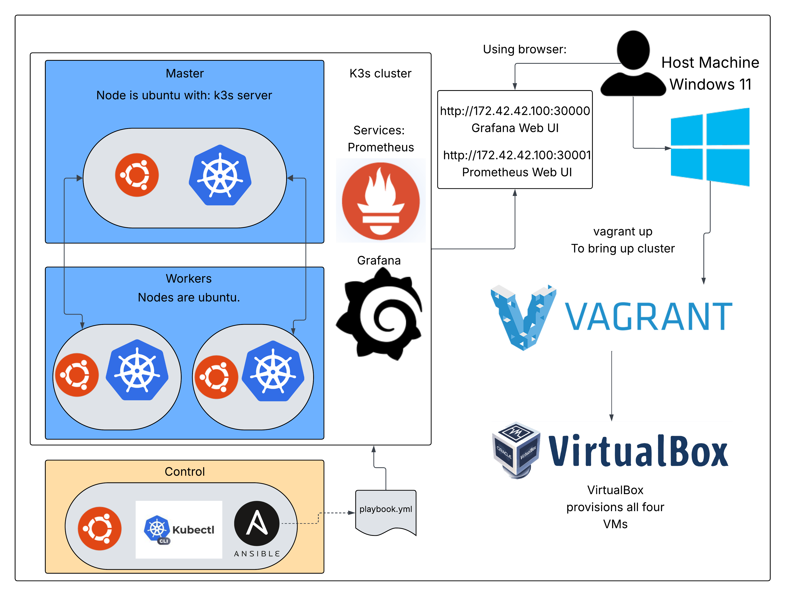

# K3s Local Cluster Deployment with VirtualBox, Vagrant, and Ansible



A k3s cluster that you can automatically launch using VirtualBox, Vagrant, and Ansible from a Windows host machine.

## Table of Contents

* [Overview](#overview)
* [Requirements](#requirements)

  * [Install Chocolatey](#install-chocolatey)
  * [Install VirtualBox, Vagrant, and Git](#install-virtualbox-vagrant-and-git)
* [Setup](#setup)
* [Starting the Cluster](#starting-the-cluster)
* [Verifying the Cluster](#verifying-the-cluster)
* [Accessing the Cluster](#accessing-the-cluster)
* [Tearing Down the Cluster](#tearing-down-the-cluster)
* [Troubleshooting](#troubleshooting)

---

## Overview

This project provides a simple and automated way to spin up a k3s Kubernetes cluster using:

* **VirtualBox** as the VM provider
* **Vagrant** to orchestrate VMs
* **Ansible** for provisioning and k3s setup

All from a **Windows host machine** using **PowerShell**.

---

## Requirements

To run this project there are a few dependencies you must install first.

* **Chocolatey** - package manager
* **Vagrant** - Infrastructure as Code tool to spin up the machines needed for the cluster
* **Ansible** - For downloading k3s to the master and worker nodes
* **VirtualBox** - Virtualization software needed to host the linux VMs
* **Git** - To download this repository

### Install Chocolatey

Chocolatey is used to simplify installation of required packages. Run PowerShell as **Administrator** and execute:

```powershell
Set-ExecutionPolicy Bypass -Scope Process -Force; [System.Net.ServicePointManager]::SecurityProtocol = [System.Net.ServicePointManager]::SecurityProtocol -bor 3072; iex ((New-Object System.Net.WebClient).DownloadString('https://community.chocolatey.org/install.ps1'))
```

After installation, restart your terminal or run `refreshenv`.

### Install VirtualBox, Vagrant, and Git

Once Chocolatey is installed, run the following in PowerShell (admin):

```powershell
choco install virtualbox vagrant git -y
```

> You may also want to install an editor like VS Code or vim:
>
> ```powershell
> choco install vscode -y
> # Or for vim 
> choco install vim -y
> ```

---

## Setup

1. **Clone this repository**:

   ```powershell
   git clone https://github.com/EthanGilles/Local-Windows-K3S-Cluster.git
   cd Local-Windows-K3S-Cluster
   ```

2. **(Optional) Customize Configuration**
   Modify the `Vagrantfile` to adjust VM specs or node count. You may also edit `inventory.ini` for Ansible host definitions.

---

## Starting the Cluster

1. **Launch the Vagrant-managed VMs** (run from your project directory in PowerShell):

   ```powershell
   vagrant up
   ```

And thats it! Your whole k3s cluster will launch and automatically start up 
because of the ansible playbook.

---

## Verifying the Cluster

1. **SSH into the master node**:

   ```powershell
   vagrant ssh master
   ```

2. **Sign into the root user:**
    ```bash 
    sudo su -
    ```


3. **Use kubectl to verify the nodes are ready**:

   ```bash
   kubectl get nodes
   ```

   You should see output showing your master and worker nodes in the `Ready` state similar to this:

   ```console
    NAME      STATUS   ROLES                  AGE   VERSION
    master    Ready    control-plane,master   17m   v1.32.4+k3s1
    worker1   Ready    <none>                 17m   v1.32.4+k3s1
    worker2   Ready    <none>                 17m   v1.32.4+k3s1
   ```

---

## Accessing the Cluster

To interact with the k3s cluster from your host environment:

1. **Copy the kubeconfig file from the master node (only if you have the vargrant-scp plugin)**:

   ```bash
   scp vagrant@master:/etc/rancher/k3s/k3s.yaml ~/.kube/config
   ```

2. **Modify the kubeconfig server IP if needed** to point to the master VM's IP.

3. **Test the connection**:

   ```bash
   kubectl get nodes
   ```

---

## Tearing Down the Cluster

To destroy all VMs created by Vagrant:

```powershell
vagrant destroy -f
```

This will remove the virtual machines and free up system resources.

---

## Troubleshooting

* **Vagrant SSH issues**: Try `vagrant reload` or `vagrant provision`.
* **VirtualBox VM boot errors**: Verify virtualization is enabled in your BIOS (VT-x/AMD-V).
* **Networking issues**: Ensure host-only adapters are properly configured in VirtualBox.

---

